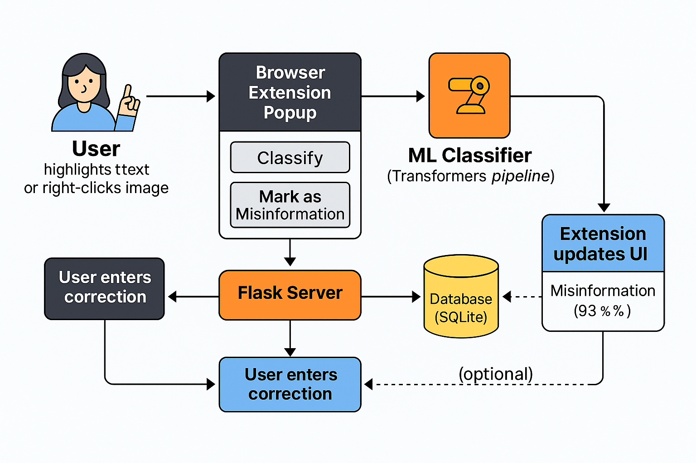

# Misinformation Classifier Browser Extension for LinkedIn
Web Browser Extension for LinkedIn that allows users to highlight &amp; report posts or comments as "Misinformation" to the original poster.

## Project FAQs

**1) Who is our project intended for?**  
Our project primarily is intended for LinkedIn users & groups who post content on behalf of non-profit organizations.

**2) What is the problem this project is trying to solve?**  
- Non-profit teams often share critical updates—fund drives, relief efforts, volunteer calls, but may inadvertently propagate misinformation or outdated details. 

- This extension streamlines detection of false or misleading claims in LinkedIn posts and comments, and provides a simple workflow to submit and broadcast official corrections.

**3) Why is this a significant problem specifically for LinkedIn?**  
- LinkedIn is a high-trust, professional network where organizational announcements and news rapidly influence donor behavior and stakeholder decisions. 

- Misinformation here can lead to misguided contributions, erode credibility, and ultimately harm the communities nonprofits serve.

**4) Why are we focusing on non-profits & social workers for this project?**  
- Non-profits and social service professionals operate with limited tech resources but share sensitive information that directly impacts vulnerable populations. 

- Equipping these groups with an accessible fact-checking and correction tool helps preserve the integrity of their communications and maintain public trust.

**5) What value does this project provide to solve the problem?**

**Instant Classification**:
- Highlight any text on LinkedIn and get an immediate “misinformation” or “OK” verdict with a confidence score.  
**Seamless Corrections**: 
- Submit official corrections and context directly from the extension, reducing friction.
**Credibility Protection**
- Helps nonprofits proactively manage their online reputation and enhance stakeholder confidence.
**Operational Efficiency**:
- Eliminates manual fact-checking workflows and centralizes correction tracking.

**6) Future Work & Considerations**

**Model Enhancements**:
- Fine-tune existing classifier or add new ones (hate speech, spam, outdated info). 
**Platform Expansion**:
- Extend support to Twitter, Facebook, Instagram, and other channels.
**Automated Posting**:
- Integrate with social APIs for one-click correction publishing.  
**Admin Dashboard**:
- Build a web interface for analytics, correction history, and user management.  
**Multilingual Support**:
- Enable classification and corrections in multiple languages.  
**Offline Client**:
- Develop a standalone desktop app (Qt/Electron) for environments without browser extension support.
